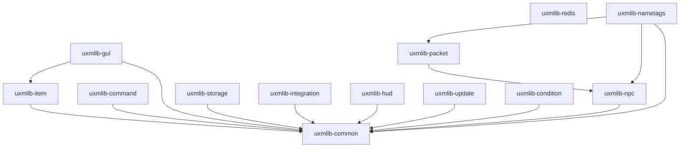

# uxmLib

[](https://jitpack.io/#UXPLIMA/uxmLib)
[](LICENSE)
[](https://adoptium.net/)
[](https://papermc.io/)
[](https://docs.papermc.io/folia)

A modern, modular toolkit for writing **Paper 1.21+** plugins on **Java 21**. It bundles the parts every
plugin ends up re-implementing — inventory GUIs, item building, Brigadier commands, typed config, pooled
storage, soft-dependency integrations, HUD overlays, holograms, a notify-only update checker, and a
config-driven condition/action engine — behind a clean, documented API, so you stop copy-pasting the same
helpers from project to project.

It is built **1.21+ only, on purpose**. No legacy cross-version reflection layers to carry around — just
the current Paper API used the way it is meant to be used, **Folia-ready from line one**, and verified by
Error Prone, NullAway null-safety, Spotless formatting, ArchUnit architecture rules, and unit tests under
`-Werror`.

Pull only the modules you use as Maven artifacts and shade them, or drop the aggregate jar on the server
and depend on it as a normal plugin. Both work.

---

## Table of contents

- [Why uxmLib](#why-uxmlib)
- [Requirements](#requirements)
- [Modules](#modules)
- [Installation](#installation)
  - [Gradle (Kotlin DSL)](#gradle-kotlin-dsl)
  - [Gradle (Groovy DSL)](#gradle-groovy-dsl)
  - [Maven](#maven)
  - [Align versions with the BOM](#align-versions-with-the-bom)
  - [Standalone plugin jar](#standalone-plugin-jar)
  - [Shading and relocation](#shading-and-relocation)
- [Feature tour](#feature-tour)
  - [Text](#text)
  - [Scheduling (Folia-ready)](#scheduling-folia-ready)
  - [Items](#items)
  - [GUIs](#guis)
  - [Commands](#commands)
  - [Configuration](#configuration)
  - [Storage](#storage)
  - [Integrations](#integrations)
  - [Holograms](#holograms)
  - [HUD overlays](#hud-overlays)
  - [Conditions & actions](#conditions--actions)
  - [Cross-server messaging](#cross-server-messaging)
  - [Update checker](#update-checker)
  - [Experimental: packet layer](#experimental-packet-layer)
- [Architecture & quality](#architecture--quality)
- [Building from source](#building-from-source)
- [Versioning & stability](#versioning--stability)
- [Contributing](#contributing)
- [License](#license)
- [Acknowledgements](#acknowledgements)

---

## Why uxmLib

- **One platform, done well.** Paper 1.21+ and Java 21 only. Every API targets the current server, with no
  reflection machinery to support servers that no longer exist.
- **Modular.** Each `uxmlib-*` module is published independently — take the GUI framework without the
  storage stack, or just the command DSL. Modules never depend "upward", so the graph stays a clean tree.
- **Folia-ready.** Nothing schedules through `BukkitScheduler`. The library's `Scheduler` abstraction maps
  cleanly onto Paper's global / region / entity / async schedulers, so the same plugin code runs unchanged
  on Folia.
- **Adventure-native.** All text is Adventure components built from MiniMessage. Legacy `§`/`&` colour
  codes are deliberately unsupported.
- **Null-safe and statically checked.** Every package is JSpecify `@NullMarked`; NullAway and Error Prone
  run as errors, formatting is enforced with Spotless (Palantir Java Format), and ArchUnit guards the
  module boundaries.
- **MIT, and clean-room.** Nothing is copied from GPL/AGPL/proprietary sources. The Minecraft-facing API is
  written from scratch; only neutral infrastructure (HikariCP, Caffeine, Configurate) is taken as a
  dependency. Use it anywhere, including in closed-source plugins.
- **Native where it can be.** GUIs, holograms, HUD overlays, and toasts use the public Paper/Adventure API
  — no packets, no per-version NMS — so they keep working across point releases.

## Requirements

| | |
| --- | --- |
| Server | Paper **1.21+** (developed against `1.21.11`) |
| Java | **21** |
| Build (consumers) | Gradle or Maven; the modules are plain Maven artifacts |

Adventure, MiniMessage, and Brigadier are provided by Paper at runtime — uxmLib references them at
compile time only and never ships them.

## Modules

Every module is published separately under the JitPack group `com.github.UXPLIMA.uxmLib`; pull only
what you use. Modules marked **experimental** are previews with unstable APIs (see
[Versioning & stability](#versioning--stability)).

| Module | What it gives you |
| --- | --- |
| `uxmlib-common` | The shared foundation: a Folia-ready `Scheduler`, MiniMessage `Text`, node-based `HoconConfig` and typed-record `RecordConfig` with hot reload and live `ConfigProperty`, a MiniMessage-native i18n message catalog, a ReDoS-guarded `TimedRegex`, type-safe particle spawning, and `Durations`/`Numbers`/`Sounds`/`SemanticVersion`/`ServerVersion` helpers. |
| `uxmlib-item` | A fluent `ItemBuilder` (name, lore, enchantments, attributes, flags, durability, banners, components, with removers), sealed `SkullData` player heads with an async skin resolver, registry lookups for the 1.21 key-based enchantments/attributes, component-safe and gzip serialization, single-key `isSimilar`, and typed persistent-data helpers. |
| `uxmlib-gui` | An inventory-menu framework: simple / paginated / scrolling / storage / typed (hopper, dispenser, …) menus; static, animated, dynamic, and per-viewer stateful items; border/row/column/rect fillers; interaction control; multi-screen navigation; menus defined in HOCON; unified anvil/chat/sign text input; and a facade over Paper's server-side Dialogs. |
| `uxmlib-command` | A thin facade over Paper's Brigadier (`Cmd`/`Args`/`Sender`/`CommandRegistrar`) **and** an annotation DSL on top of it: `@Command`/`@Subcommand`/`@Arg`, permissions, `@Range`/`@Length`, `@Cooldown`, flags and switches, async execution, help pagination, and resolver/validator/condition SPIs. |
| `uxmlib-storage` | Plain-JDBC persistence: a HikariCP-pooled `Database` (SQLite default; MySQL/MariaDB, PostgreSQL, H2 opt-in), an injection-safe `SelectBuilder`, parameterised `Sql`/`TxSql`, versioned migrations, a Caffeine-backed write-through / write-behind cache, a two-tier player-profile cache, and cross-server row sync. |
| `uxmlib-redis` | A low-level binary (`byte[]`) Redis pub/sub bus for fanning an opaque frame across the server nodes sharing one Redis — fail-degraded publish, per-subscription auto-reconnect — with no relational dependencies (Lettuce is a compile-only soft-dependency). |
| `uxmlib-integration` | Soft-dependency hooks reached only past a present-guard: PlaceholderAPI (read **and** expansion registration), Vault and VaultUnlocked economy, Vault permissions, LuckPerms, WorldGuard/Towny region queries, a transient advancement-toast API, an online-data lifecycle manager, a dependency-free Discord webhook, and native-`Display` [holograms](#holograms). |
| `uxmlib-hud` | Adventure-native HUD overlays, all through the public player API: a flicker-free diffing sidebar, title/subtitle, a sticky action bar, boss bars with a mode enum (permanent/filling/countdown/dynamic), tablist header/footer, and per-tick text animators. |
| `uxmlib-update` | A notify-only release update checker (GitHub / Modrinth providers) that compares a build-time version constant against the latest release and surfaces a permission-gated clickable join message. It never self-downloads. |
| `uxmlib-condition` | A declarative condition engine (operand comparison + placeholder resolution + failure policy) and its natural pair, a config-driven action engine (`[message]`, `[console]`, `[title]`, … parsed once into closures). |
| `uxmlib-npc` | **Experimental.** A from-scratch, MIT-clean Netty pipeline foundation — channel resolve, idempotent inject/eject, a self-healing reorder watchdog, and a fail-open listener seam. Groundwork for the packet layer; no NPC yet. |
| `uxmlib-packet` | **Experimental.** The shared Mojang-mapped packet helpers (Adventure→vanilla component conversion, bundling, the stream-codec buffer trick, guarded reflection, entity-id allocation) plus per-viewer tab-list, NPC, and text-display packet ports built on them. |
| `uxmlib-nametags` | **Experimental.** A from-scratch per-viewer nametag renderer (different prefixes/colours/visibility per viewer) over scoreboard-team and metadata packets, without touching the server-side scoreboard. |
| `uxmlib-bom` | A bill of materials so a consumer can align every `uxmlib-*` artifact to one version with a single platform import. |
| `uxmlib-all` | The aggregate of every module on the API surface, and the standalone server-side plugin jar. |



## Installation

uxmLib is published through [JitPack](https://jitpack.io/#UXPLIMA/uxmLib). Add the JitPack repository
(plus Paper's, since the modules compile against the Paper API), then the modules you need. JitPack serves
each module under the group `com.github.UXPLIMA.uxmLib` with the git tag as the version.

> Replace `VERSION` with the latest released tag — the version shown on the JitPack badge above.

### Gradle (Kotlin DSL)

```kotlin
repositories {
    mavenCentral()
    maven("https://repo.papermc.io/repository/maven-public/")
    maven("https://jitpack.io")
}

dependencies {
    implementation("com.github.UXPLIMA.uxmLib:uxmlib-gui:VERSION")
    implementation("com.github.UXPLIMA.uxmLib:uxmlib-item:VERSION")
    implementation("com.github.UXPLIMA.uxmLib:uxmlib-command:VERSION")
    // ...and uxmlib-common / uxmlib-storage / uxmlib-integration / uxmlib-hud /
    // uxmlib-update / uxmlib-condition as needed
}
```

### Gradle (Groovy DSL)

```groovy
repositories {
    mavenCentral()
    maven { url 'https://repo.papermc.io/repository/maven-public/' }
    maven { url 'https://jitpack.io' }
}

dependencies {
    implementation 'com.github.UXPLIMA.uxmLib:uxmlib-gui:VERSION'
    implementation 'com.github.UXPLIMA.uxmLib:uxmlib-item:VERSION'
}
```

### Maven

```xml
<repositories>
  <repository>
    <id>papermc</id>
    <url>https://repo.papermc.io/repository/maven-public/</url>
  </repository>
  <repository>
    <id>jitpack.io</id>
    <url>https://jitpack.io</url>
  </repository>
</repositories>

<dependency>
  <groupId>com.github.UXPLIMA.uxmLib</groupId>
  <artifactId>uxmlib-gui</artifactId>
  <version>VERSION</version>
</dependency>
```

### Align versions with the BOM

Importing the BOM lets you list modules without repeating the version on each one:

```kotlin
dependencies {
    implementation(platform("com.github.UXPLIMA.uxmLib:uxmlib-bom:VERSION"))

    implementation("com.github.UXPLIMA.uxmLib:uxmlib-gui")
    implementation("com.github.UXPLIMA.uxmLib:uxmlib-item")
    implementation("com.github.UXPLIMA.uxmLib:uxmlib-storage")
}
```

### Standalone plugin jar

Prefer not to shade? Drop the aggregate `uxmlib-all` jar in the server's `plugins/` folder and have your
plugins depend on it as a normal Paper dependency:

```yaml
# paper-plugin.yml
depend:
  - uxmlib
```

The standalone jar registers only the handful of listeners whose behaviour is driven entirely by item
persistent data; the rest of the library is consumed as an API.

### Shading and relocation

When you shade individual modules into your own jar, relocate `com.uxplima.uxmlib` to avoid clashing with
another plugin that also bundles uxmLib:

```kotlin
tasks.shadowJar {
    relocate("com.uxplima.uxmlib", "com.yourplugin.libs.uxmlib")
}
```

The config and storage layers locate their codecs through the JDK `ServiceLoader`. If you enable the Shadow
plugin's `minimize()`, keep the service-provider files and their backing classes, or config parsing will
fail at runtime with a missing-serializer error:

```kotlin
tasks.shadowJar {
    minimize {
        exclude("META-INF/services/**")
        exclude(dependency("org.spongepowered:configurate-.*:.*"))
    }
}
```

## Feature tour

The examples below assume the MiniMessage text helper is imported:

```java
import com.uxplima.uxmlib.text.Text;
import net.kyori.adventure.text.Component;
```

### Text

`Text` is the single place a plugin turns a MiniMessage string into an Adventure `Component`.

```java
Component title = Text.mini("<gradient:#ff5555:#ffaa00>Welcome</gradient>");
Component greet = Text.mini("<gray>Hello, <player>!", Text.placeholder("player", name));

String plain = Text.plain(title);     // strip formatting for logs
String mm    = Text.serialize(title); // round-trip back to MiniMessage
```

### Scheduling (Folia-ready)

One `Scheduler` interface covers Paper's four schedulers; build it once and inject it everywhere. Every
method returns a cancellable `TaskHandle`, so your plugin never touches `BukkitScheduler` and runs
unchanged on Folia.

```java
Scheduler scheduler = new PaperScheduler(plugin);

scheduler.global(() -> broadcast());                                  // next tick, global region
scheduler.regionLater(location, Duration.ofSeconds(2), () -> grow()); // region-threaded
scheduler.entityTimer(player, Duration.ZERO, Duration.ofSeconds(1),
        handle -> { if (done) handle.cancel(); });                    // entity-threaded, repeating
scheduler.async(() -> fetchFromApi());                                // off the main thread
```

### Items

```java
ItemStack sword = ItemBuilder.of(Material.DIAMOND_SWORD)
        .name(Text.mini("<gradient:#ff5555:#ffaa00>Flameblade</gradient>"))
        .lore(Text.mini("<gray>A legendary weapon"))
        .enchant(Items.enchantment("sharpness"), 5)   // 1.21 made enchantments registry entries
        .flags(ItemFlag.HIDE_ENCHANTS)
        .unbreakable(true)
        .build();

ItemStack head = ItemBuilder.of(Material.PLAYER_HEAD)
        .skull(SkullData.ofName("Notch"))
        .build();

String saved = ItemSerialization.toBase64(sword);  // survives every data component
ItemStack back = ItemSerialization.fromBase64(saved);
```

### GUIs

Install the framework once in `onEnable`, then build menus fluently. Clicks are cancelled by default — an
unconfigured menu can never leak items.

```java
Guis.install(plugin, scheduler);   // the Scheduler overload enables animation and auto-refresh

SimpleGui menu = Guis.gui().title(Text.mini("<dark_aqua>Menu")).rows(3).build();
menu.filler().fillBorder(GuiItem.display(pane));        // border / row / column / rect / fill helpers
menu.set(2, 5, GuiItem.button(icon, e -> click()));     // 1-indexed row, col
menu.onClose(event -> persist());
menu.open(player);

// Paginated, scrolling, and non-chest shapes:
PaginatedGui shop = Guis.paginated().title(Text.mini("Shop")).rows(6).build();
products.forEach(p -> shop.addPageItem(GuiItem.button(p.icon(), e -> buy(p))));
shop.open(player);

ScrollingGui list = Guis.scrolling(ScrollType.VERTICAL).rows(4).build();

// A storage menu holds real items (take/place allowed) and keeps them across opens:
StorageGui vault = Guis.storage().rows(3).build();
vault.onClose(e -> save(vault.contents()));

// Per-viewer items: dynamic (computed per player), stateful (first matching state), animated:
menu.set(4, GuiItem.dynamic(ctx -> headOf(ctx.viewer())));
menu.set(5, GuiItem.stateful()
        .display(ctx -> ctx.viewer().hasPermission("vip"), vipIcon)
        .display(ctx -> true, normalIcon)
        .build());
menu.set(6, GuiItem.animated(List.of(frame1, frame2), Duration.ofMillis(250)));

// Multi-screen navigation with a back-stack:
GuiNavigator nav = new GuiNavigator();
nav.open(player, mainMenu);
subMenu.set(8, GuiItem.back(nav, backArrow));

// Define a menu in HOCON (operators re-skin; code owns the actions):
MenuActions actions = new MenuActions().register("buy", e -> openShop(e));
SimpleGui fromFile = MenuConfig.load(configNode, actions);
```

### Commands

Both styles register through Paper's Brigadier lifecycle. Use the annotation DSL for the common case, or
the `Cmd` facade when you need to hand-build a node tree.

```java
@Command(name = "money", description = "Manage balances")
class MoneyCommand {

    @Subcommand("pay")
    @Permission("money.pay")
    void pay(Sender sender, @Arg("target") String target, @Arg(value = "amount", min = 1) int amount) {
        sender.send(Text.mini("<green>Paid " + amount + " to " + target));
    }
}

AnnotatedCommands.register(plugin, new MoneyCommand());
```

```java
// Or build the tree yourself:
CommandRegistrar.register(plugin,
        Cmd.literal("ping").requires(Cmd.permission("x.ping"))
                .executes(ctx -> {
                    Sender.of(ctx.getSource()).send(Text.mini("pong"));
                    return Cmd.OK;
                }),
        "Replies with pong");
```

The annotation layer also covers `@Range`/`@Length` bounds, `@Cooldown` rate limits, `@PlayerOnly`, flags
and switches, async execution, and paginated help — with SPIs for custom argument resolvers, validators,
and conditions.

### Configuration

Typed configuration over Configurate (HOCON) — config is data with IDE support, not string-keyed lookups.

```java
HoconConfig config = HoconConfig.load(dataFolder.resolve("config.conf"));

int limit = config.getInt("homes.limit", 3);

ConfigProperty<Integer> live = config.intProperty("homes.limit", 3);
live.onChange(value -> rebuildLimits(value));   // fires on reload when the value changes
config.reload();
```

```java
// Or map a whole file onto one @ConfigSerializable record, hot-reloaded as an atomic snapshot:
RecordConfig<Settings> settings =
        new RecordConfig<>(dataFolder.resolve("settings.conf"), Settings.class, Settings::new);

Settings current = settings.current();   // cached snapshot — cheap on the hot path
settings.reload();                        // swaps in the new value, or keeps the prior one on a parse error
```

### Storage

```java
Database db = Database.builder().sqlite(dataFolder.resolve("data.db")).build();  // SQLite default, WAL
Sql sql = new Sql(db);
sql.execute("CREATE TABLE IF NOT EXISTS players (uuid TEXT PRIMARY KEY, coins INTEGER)");

// Versioned migrations run exactly once each, in order:
new MigrationRunner(db).apply(List.of(
        new Migration(1, "init", "CREATE TABLE warps (name TEXT PRIMARY KEY)")));

// Injection-safe query builder with bound parameters:
Query top = SelectBuilder.from("players")
        .where("coins", ">=", 100)
        .orderByDescending("coins")
        .limit(10)
        .build();
List<String> leaders = sql.query(top, row -> row.getString("uuid"));
```

Switch to a network backend by giving the builder a JDBC URL and credentials (`jdbcUrl(...)`,
`username(...)`, `password(...)`) and adding the matching driver — MariaDB/MySQL, PostgreSQL, and H2 are
opt-in. Higher-level helpers add a write-through / write-behind cache, a two-tier player-profile cache, and
cross-server row sync.

### Integrations

Every third-party symbol is touched only past a plugin-present guard, so a server without the soft-dependency
still loads cleanly.

```java
// Economy: resolves Vault or VaultUnlocked, with a no-op dummy so call sites never null-check.
EconomyBridge.orDummy().deposit(player, 100);

// Permissions / ranks via LuckPerms, present-guarded:
LuckPermsHook.find().flatMap(lp -> lp.prefix(player)).ifPresent(prefix -> applyPrefix(prefix));

// PlaceholderAPI — a no-op pass-through without PlaceholderAPI installed:
String text = Placeholders.apply(player, "Hi %player_name%");

// Region queries against WorldGuard or Towny behind one provider-agnostic contract:
RegionHooks regions = new RegionHooks();
WorldGuardRegionService.find().ifPresent(regions::register);   // present-guarded
boolean canBuild = regions.active()
        .map(region -> region.canBuild(player, location))
        .orElse(true);

// A transient toast that leaves no persistent advancement behind:
Toast.builder()
        .icon(Material.DIAMOND)
        .title(Text.mini("<gold>Objective complete!"))
        .show(player);

// A dependency-free Discord webhook (no JDA, no bot token):
new DiscordWebhook(url).sendEmbed(DiscordEmbed.colored("Alert", "Server started", 0x00FF00));
```

The PlaceholderAPI integration also has a write side: register a `PlaceholderProvider` to expose your own
`%uxm_<prefix>_<params>%` placeholders.

### Holograms

Holograms are built on native 1.21+ `Display` entities (Text / Item / Block) — no packets, no per-version
NMS — and managed for you so visibility, per-viewer content, and cleanup are handled automatically.

```java
HologramManager holograms = new HologramManager();
holograms.installLifecycleListener(plugin);   // resets per-player state on quit / world change

Hologram spawn = holograms.spawn(
        Holograms.builder()
                .line(Text.mini("<yellow><bold>Spawn"))
                .line(Text.mini("<gray>Welcome to the server"))
                .billboard(Display.Billboard.CENTER)
                .glow(Color.YELLOW),
        location);
```

On top of that base the module adds a distance-driven visibility `HologramPool`, per-player widgets
(paged, switchable, live leaderboard), entity-following holograms, text animation (typewriter / scroll),
a Mojang skin resolver for player-head displays, and holograms defined in HOCON.

### HUD overlays

Adventure-native overlays delivered through Paper's own player API — no packets, no NMS.

```java
// Flicker-free sidebar: only the lines that actually changed are re-sent.
SidebarManager sidebars = new SidebarManager(Bukkit.getScoreboardManager());
Sidebar sb = sidebars.create(player, Text.mini("<gold><bold>Server"));
sb.lines(List.of(
        Text.mini("<gray>Online: <white>42"),
        Text.mini("<gray>Map: <white>spawn")));
sb.show();

new Titles().show(player, Text.mini("<green>Welcome"), Text.mini("<gray>have fun"));
new Tablist().set(player, header, footer);

new ActionBarManager(scheduler, server).show(player, Text.mini("<yellow>Saved!"), Duration.ofSeconds(3));
new BossBarManager(scheduler, server).countdown(player, Text.mini("<red>Event"), Duration.ofMinutes(1));
```

### Conditions & actions

A config-driven gate plus a config-driven action list — both parsed once and run many times.

```java
// Resolve %...% through an injected resolver, compare, and collect a failure message:
ConditionList gate = ConditionList.of(
        PlaceholderCondition.parse("%player_level% >= 30"),
        Text.mini("<red>You need level 30"));
boolean allowed = gate.test(ConditionRequest.forPlayer(player));

// Named actions parsed once into closures and run in order:
ActionList.parse(List.of(
        "[message] <green>Hi %player_name%",
        "[console] heal %player_name%")).run(context);
```

### Cross-server messaging

`uxmlib-redis` is a lean binary pub/sub primitive for fanning a message across the nodes sharing one Redis,
with no relational dependencies. For cache invalidation tied to the storage stack, `uxmlib-storage` builds
its `DataSynchronizer` on the same idea — a `LocalDataSynchronizer` single-node default that a
`RedisDataSynchronizer` bridges across nodes when Redis is configured.

```java
bus.subscribe("party-updates", frame -> applyUpdate(frame));   // RedisBus: opaque byte[] frames
bus.publish("party-updates", encode(update));                  // fail-degraded, auto-reconnecting
```

### Update checker

Notify-only: it logs to the console and shows a permission-gated clickable message on join. It never
self-downloads.

```java
UpdateChecker checker = new UpdateChecker(
        scheduler, new GitHubReleaseProvider("you", "your-plugin"), UxmLibVersion.VERSION);

new UpdateNotifier(plugin, scheduler, checker, "yourplugin.update.notify")
        .start(Duration.ofSeconds(40), Duration.ofHours(6));
```

### Experimental: packet layer

`uxmlib-npc`, `uxmlib-packet`, and `uxmlib-nametags` are an in-progress, **clean-room** packet foundation
for the things the public API cannot do per viewer — different nametag colours, tab-list rows, or holograms
for different players. PacketEvents (the off-the-shelf choice) is GPL, so none of it is borrowed; the Netty
plumbing is re-implemented for Paper 1.21+ and the unavoidable NMS is quarantined to single, named classes
behind pure ports built against the Mojang-mapped dev bundle.

These modules have **unstable APIs** and parts are still landing. Treat them as a preview; the stable
toolkit above does not depend on them.

## Architecture & quality

- **Package root** `com.uxplima.uxmlib`, one sub-package per concern, every package `@NullMarked`.
- **No upward dependencies.** `common` depends on nothing internal; everything may depend on `common`;
  `gui` depends on `item`; `all` aggregates. ArchUnit tests enforce that there are no cycles.
- **Constructor injection, no static mutable state.** The only `JavaPlugin` is the thin shell in
  `uxmlib-all`; library types are plain objects you construct and inject.
- **Input validation at every public entry**, small methods and classes, no SQL string concatenation, no
  empty catches, no `printStackTrace`.
- **Static analysis as errors.** Error Prone + NullAway (`onlyNullMarked`, JSpecify), Spotless with
  Palantir Java Format, all under `-Werror`.
- **Tests.** JUnit 5, AssertJ, Mockito, MockBukkit (Paper 1.21 line), jqwik property tests, and ArchUnit.

## Building from source

Requires a JDK 21 toolchain (Gradle provisions it via the Foojay resolver if needed).

```bash
./gradlew build                   # compile, format check, static analysis, tests
./gradlew spotlessApply           # auto-format before checking
./gradlew :uxmlib-all:shadowJar   # the standalone plugin jar
./gradlew publishToMavenLocal     # install every module to ~/.m2 to try locally
```

## Versioning & stability

The library follows semantic versioning. Public API modules aim for stable names and documented seams; the
**experimental** modules (`uxmlib-npc`, `uxmlib-packet`, `uxmlib-nametags`) may change without notice until
they graduate. Pre-1.0 (`0.x`) releases may still adjust APIs between minor versions as the surface settles.

## Contributing

Issues and pull requests are welcome. The workflow is test-first: add a failing test, write the minimum
implementation, run `./gradlew spotlessApply` then `./gradlew build` green before committing. Keep to the
existing conventions — `@NullMarked` packages, constructor injection, no upward module dependencies, and
Adventure/MiniMessage for all text.

## License

[MIT](LICENSE) — © UXPLIMA. Use it anywhere, including in closed-source plugins.

## Acknowledgements

uxmLib is an independent, clean-room implementation. Where a permissively licensed project informed an
approach — Triumph GUI and AnvilGUI (menu and anvil-input patterns), Item-NBT-API and Rtag (item data),
Lamp (command annotations), HamsterAPI (the pipeline-injection technique), and FancyHolograms (the
per-viewer text-override approach) — it is acknowledged here. No code is copied from any GPL/AGPL or
proprietary source.
